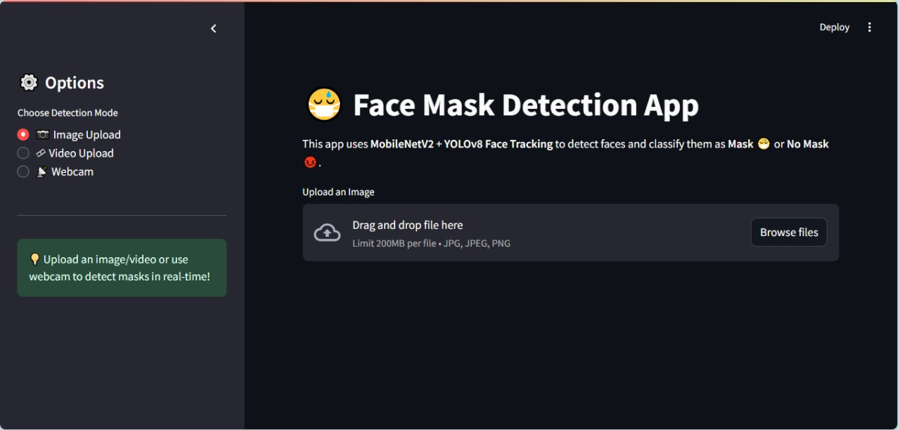
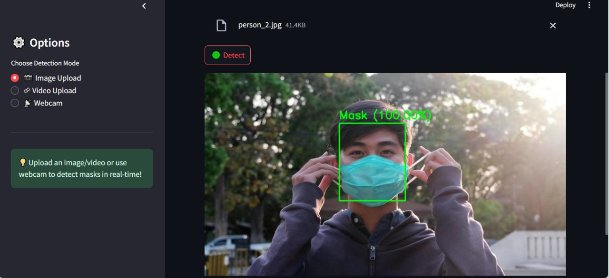
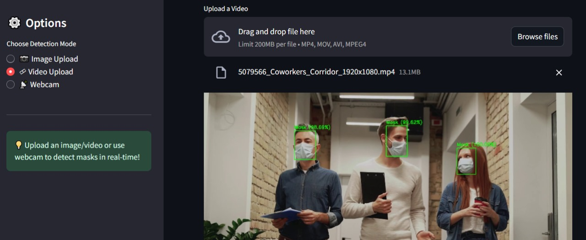
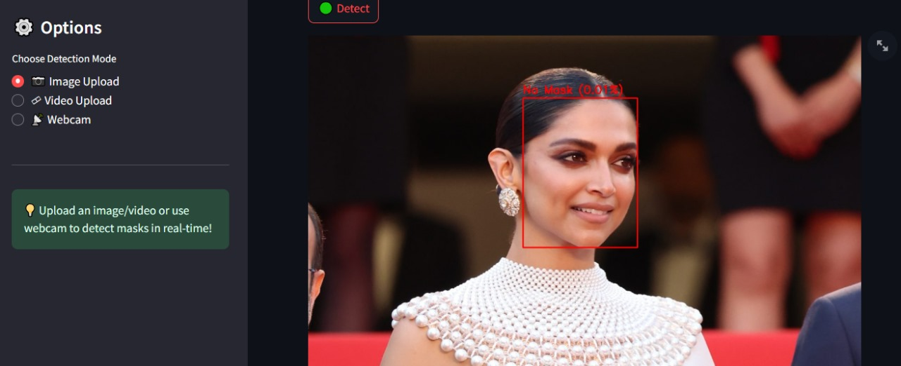

# 🦠 Face Mask Detection

This project is a **deep learning-based system** that detects whether people are wearing a **face mask** 😷 or **not wearing a mask** ❌.

It combines **YOLOv8** (for face detection) with a **MobileNetV2 classifier** (for mask classification). The app is built with **Streamlit**, supporting **images, video files, and real-time webcam detection**.

---

## 📖 Project Overview

During the COVID-19 pandemic, face masks became essential for public health safety.  
This project was developed to automatically detect masks in real-time video streams, images, and webcam input.

**Workflow includes:**
- **Face Detection** → Using YOLOv8 to detect human faces in frames.  
- **Mask Classification** → Using MobileNetV2 to classify whether the detected face has a mask or not.  
- **Visualization** → Bounding boxes with labels (“Mask” or “No Mask”) are drawn on the output.  

---

## ✨ Features

- 📷 **Image Upload** → Detect masks on uploaded images.  
- 🎥 **Video Upload** → Detect masks in videos.  
- 🎦 **Webcam Detection** → Real-time mask detection through webcam.  
- 🎨 **Streamlit UI** → User-friendly interface with separate options for image, video, and webcam.  
- 📊 **Result Display** → Visual output with bounding boxes and labels.  

---

## 🛠️ Tech Stack

- **Python** 
- **TensorFlow / Keras** → Mask classification model (MobileNetV2)  
- **YOLOv8 (Ultralytics)** → Face detection  
- **OpenCV** → Image/video processing  
- **Streamlit** → Web app interface  

---

## 📂 Project Structure

```bash
Face_Mask_Detection/
│── app.py                     # Main Streamlit application
│── yolov8n-face.pt            # YOLOv8 pre-trained face detection weights
│── mobilenetv2_model.h5       # Trained MobileNetV2 mask classifier
│── mobilenetv2_model.keras
│── Model_Training.ipynb       # Jupyter Notebook for training the model
│── requirements.txt
│── assets                     # Output images
```


---

## ▶️ How to Run

### 1️⃣ Clone the Repository
```bash
git clone https://github.com/niyatipatel2005/Face_Mask_Detection.git
cd Face_Mask_Detection
```

### 2️⃣ Install Dependencies
```bash
pip install -r requirements.txt
```

### 3️⃣ Run the Application
```bash
streamlit run app.py
```

### 4️⃣ Open in Browser
```bash
Streamlit will start on → http://localhost:8501
```

---------

## 📸 Output Samples




### ✅ Mask Detected





### ❌ No Mask Detected




------

## 📊 Results

- The system can successfully classify faces as Mask or No Mask in real-time.
- Works on images, video uploads, and webcam streams.
- Achieved good accuracy with MobileNetV2 as classifier.

--------

## Authors

* Niyati Patel  -  https://github.com/niyatipatel2005


## License

This project is licensed under the [NAME HERE] License - see the LICENSE.md file for details


## Acknowledgments


We would like to thank the following for their support and inspiration throughout the project:

- [Kaggle](https://www.kaggle.com/datasets/omkargurav/face-mask-dataset) for providing the original **Face Mask Dataset** used for training our model.  
- The **Ultralytics team** for creating and maintaining [YOLOv8](https://github.com/ultralytics/ultralytics), which made face detection highly efficient.  
- The **TensorFlow/Keras community** for providing MobileNetV2 and related resources for transfer learning.  
- The open-source community for invaluable tools such as **OpenCV**, **Streamlit**, and **NumPy** that powered our development workflow.   
- The creators of **educational blogs, tutorials, and Stack Overflow discussions** that helped us overcome technical hurdles.  
- **GitHub and VS Code** for being the backbone of our collaboration and development process.  

✨ Inspiration, guidance, and snippets from these sources have been invaluable in making this project successful.  

